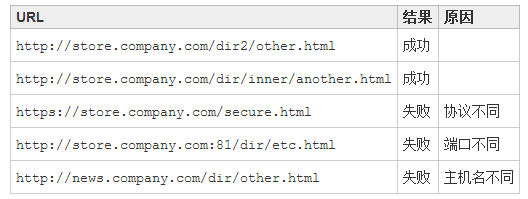
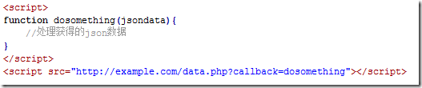
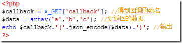
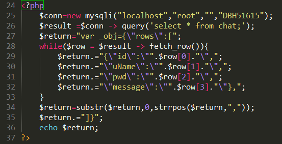
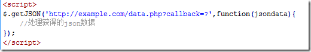
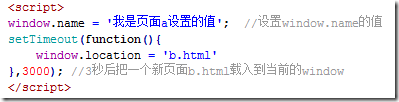
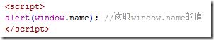
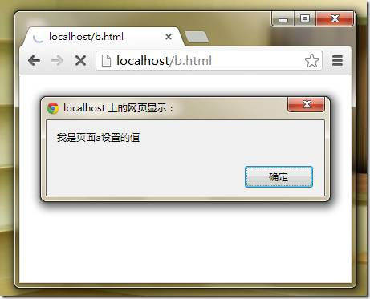
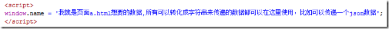
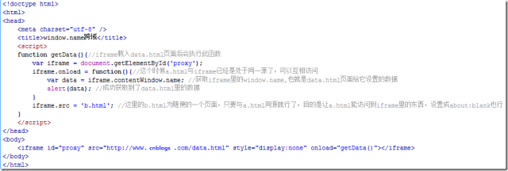

##一、JS 中几种实用的跨域方法原理详解
     这里说的 JS 跨域是指通过 JS 在不同的域之间进行数据传输或通信，比如用ajax向一个不同的域请求数据，或者  
     通过js获取页面中不同域的框架中(iframe)的数据。只要协议、域名、端口有任何一个不同，都被当作是不同的域。
     下表给出了相对 http://store.company.com/dir/page.html 同源检测的结果:

	
	
	要解决跨域的问题，我们可以使用以下几种方法：
    1.通过 jsonp 跨域

	在js中，我们直接用XMLHttpRequest请求不同域上的数据时，是不可以的。但是，在页面上引入不同域上的js脚本文件  
    却是可以的，script标签里的src属性来完成的，jsonp正是利用这个特性来实现的。
	
	比如，有个a.html页面，它里面的代码需要利用ajax获取一个不同域上的json数据，假设这个json数据地址是  
    http://example.com/data.php,那么a.html中的代码就可以这样：

    我们看到获取数据的地址后面还有一个callback参数，按惯例是用这个参数名，但是你用其他的也一样。当然如果获取数  
    据的jsonp地址页面不是你自己能控制的，就得按照提供数据的那一方的规定格式来操作了。

    因为是当做一个js文件来引入的，所以http://example.com/data.php返回的必须是一个能执行的js文件，所以这个页面  
    的php代码可能是这样的:

    最终那个页面输出的结果是:

	dosomething(['a','b','c']);
	
	又比如，php代码也可能是这样的:

  
    先连接一个数据库，再从中获取名字叫chat的表，下面就循环输出它。

	最终那个页面输出的结果就是我们需要的json数据:var _obj={"rows":[{ "id":0,"uName":"李四","pwd":"123456",  
    "message":"he said",..........}]}     里面还有很多就不一一列举了。
	
	所以通过http://example.com/data.php?callback=dosomething得到的js文件，就是我们之前定义的dosomething函数,  
    并且它的参数就是我们需要的json数据，这样我们就跨域获得了我们需要的数据。
	
	这样jsonp的原理就很清楚了，通过script标签引入一个js文件，这个js文件载入成功后会执行我们在url参数中指定的函数，  
    并且会把我们需要的json数据作为参数传入。所以jsonp是需要服务器端的页面进行相应的配合的。
	
	知道jsonp跨域的原理后我们就可以用js动态生成script标签来进行跨域操作了，而不用特意的手动的书写那些script标签。  
    如果你的页面使用jquery，那么通过它封装的方法就能很方便的来进行jsonp操作了。

     
    2.使用window.name来进行跨域

    window对象有个name属性，该属性有个特征：即在一个窗口(window)的生命周期内,窗口载入的所有的页面都是共享一个  
    window.name的，每个页面对window.name都有读写的权限，window.name是持久存在一个窗口载入过的所有页面中的，并不会因新页面的载入而进行重置。

    比如：有一个页面a.html,它里面有这样的代码：

      
    再看看b.html页面的代码：
  
      
    a.html页面载入后3秒，跳转到了b.html页面，结果为：
  

	我们看到在b.html页面上成功获取到了它的上一个页面a.html给window.name设置的值。如果在之后所有载入的页面都没对  
    window.name进行修改的话，那么所有这些页面获取到的window.name的值都是a.html页面设置的那个值。当然，如果有需要，  
    其中的任何一个页面都可以对window.name的值进行修改。注意，window.name的值只能是字符串的形式，这个字符串的大小最  
    大能允许2M左右甚至更大的一个容量，具体取决于不同的浏览器，但一般是够用了。
	
	上面的例子中，我们用到的页面a.html和b.html是处于同一个域的，但是即使a.html与b.html处于不同的域中，  
    上述结论同样是适用的，这也正是利用window.name进行跨域的原理。
	
	下面就来看一看具体是怎么样通过window.name来跨域获取数据的。还是举例说明。
	
	比如有一个www.example.com/a.html页面,需要通过a.html页面里的js来获取另一个位于不同域上的  
    页面www.cnblogs.com/data.html里的数据。
	
	data.html页面里的代码很简单，就是给当前的window.name设置一个a.html页面想要得到的数据值。data.html里的代码：
	
	
	
	那么在a.html页面中，我们怎么把data.html页面载入进来呢？显然我们不能直接在a.html页面中通过改变  
    window.location来载入data.html页面，因为我们想要即使a.html页面不跳转也能得到data.html里的数据。  
    答案就是在a.html页面中使用一个隐藏的iframe来充当一个中间人角色，由iframe去获取data.html的数据，  
    然后a.html再去得到iframe获取到的数据。
	
	充当中间人的iframe想要获取到data.html的通过window.name设置的数据，只需要把这个iframe的src  
    设为www.cnblogs.com/data.html就行了。然后a.html想要得到iframe所获取到的数据，  
    也就是想要得到iframe的window.name的值，还必须把这个iframe的src设成跟a.html页面同一个域才行，  
    不然根据前面讲的同源策略，a.html是不能访问到iframe里的window.name属性的。这就是整个跨域过程。
	
	看下a.html页面的代码：

	
	
	
	上面的代码只是最简单的原理演示代码，你可以对使用js封装上面的过程，比如动态的创建iframe,  
    动态的注册各种事件等等，当然为了安全，获取完数据后，还可以销毁作为代理的iframe。网上也有很多类似的现成代码  
    ，有兴趣的可以去找一下。
	
	通过window.name来进行跨域，就是这样子的。

